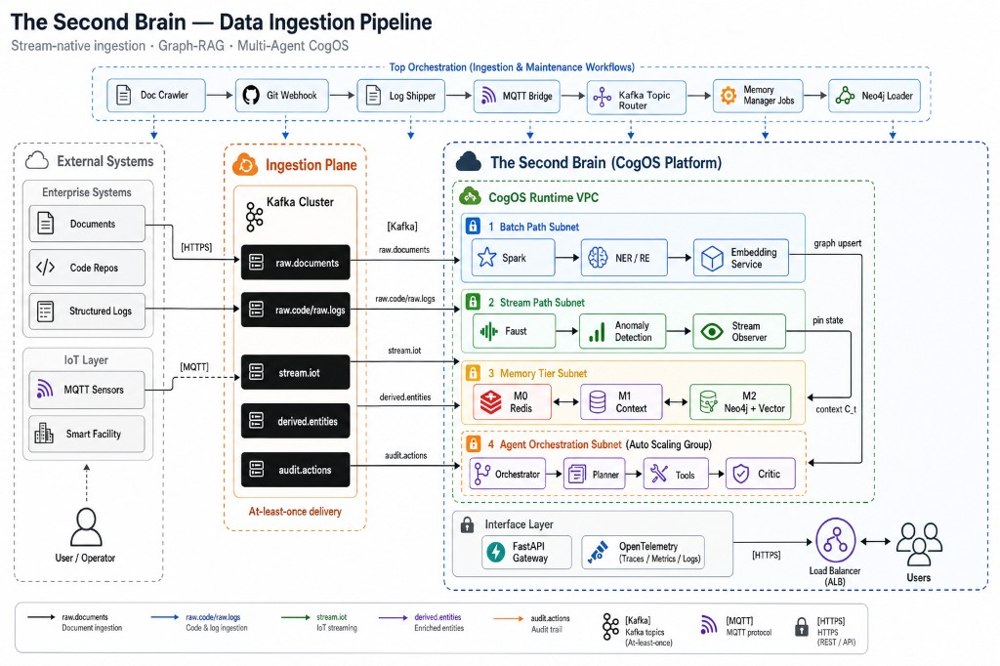
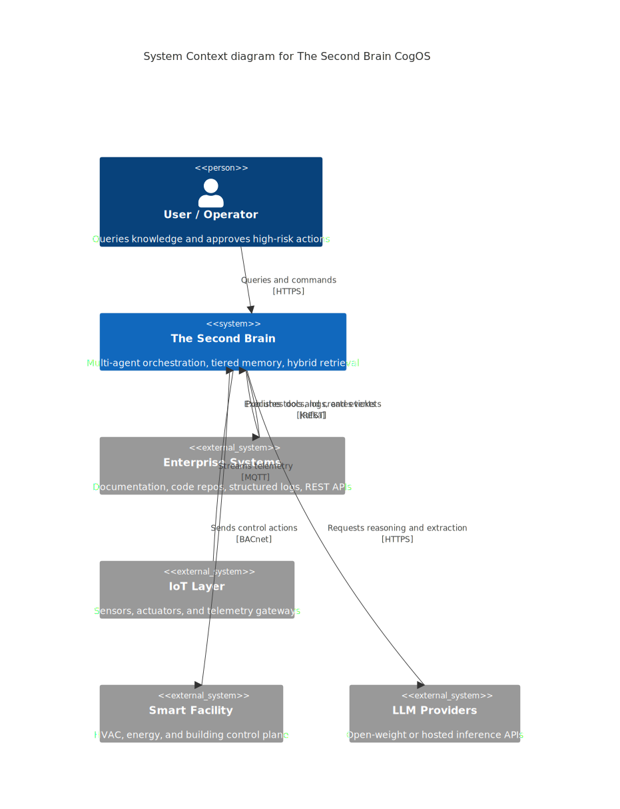
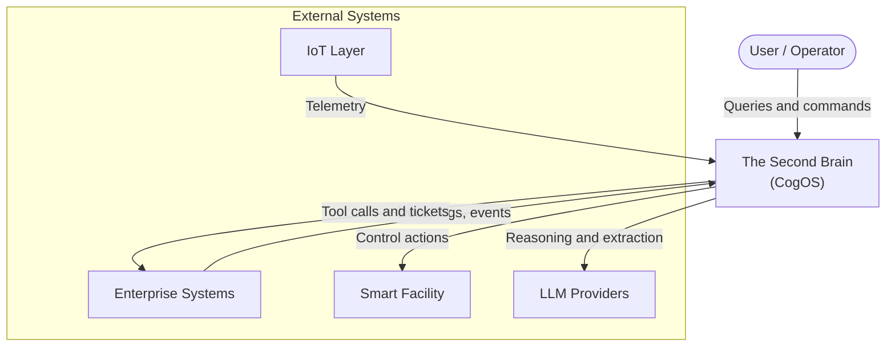

<div align="center">

# 🧠 The Second Brain

**An open-source Cognitive Operating System (CogOS)**

Multi-agent orchestration · hierarchical memory (M₀/M₁/M₂) · graph-augmented hybrid retrieval · stream-native ingestion

[](https://www.python.org/)
[](LICENSE)
[](https://github.com/langchain-ai/langgraph)
[](https://neo4j.com/)
[](https://kafka.apache.org/)

Inspired by **MemGPT**, **Generative Agents**, and **Graph-RAG**

[Quick Start](#-quick-start) · [Architecture](#-architecture) · [API](#-api-reference) · [Docs](docs/ARCHITECTURE_WORKFLOW.md)

<br/>



*Stream-native ingestion · Graph-RAG · Multi-Agent CogOS — external systems → Kafka → Spark/Faust → memory tiers → agent orchestration*

</div>

---

## Overview

**The Second Brain** is a production-grade cognitive engine that unifies enterprise knowledge, real-time IoT streams, and autonomous agent reasoning into a single platform. Unlike flat RAG systems, CogOS partitions memory by latency and cognitive role, routes every answer through a **Critic** with provenance requirements, and supports human-in-the-loop actuation for high-risk IoT actions.

| Capability | Description |
|------------|-------------|
| **Tiered Memory** | M₀ working (Redis) → M₁ short-term (context) → M₂ long-term (Neo4j + vectors) |
| **Graph-RAG** | Hybrid vector + graph retrieval with community summaries |
| **Multi-Agent** | LangGraph orchestrator, planner, tool executor, critic, stream observer |
| **Stream-Native** | Kafka ingestion, Faust IoT windows, anomaly → agent trigger |
| **Evidence-Grounded** | Every response passes critic verification with citation chain |

---

## Architecture

Architecture diagrams follow **AWS-style reference layouts**: external systems on the left, ingestion plane in the center, CogOS runtime VPC with color-coded subnets, and labeled protocol arrows (`[HTTPS]`, `[Kafka]`, `[MQTT]`).

### System Context

External actors and how they connect to CogOS.



<details>
<summary><strong>Mermaid source (GitHub renders inline)</strong></summary>



</details>

---

### Data Ingestion Pipeline

Continuous path from external data sources through Kafka into batch (Spark) and stream (Faust) processing subnets, then into memory tiers and agent orchestration.


> **Diagram layers:** External Systems → Ingestion Plane (Kafka) → CogOS Runtime VPC (Batch / Stream / Memory / Agents) → Interface Layer (FastAPI + OpenTelemetry)

| Subnet | Color | Components |
|--------|-------|------------|
| **Batch Path** | Blue | Spark → NER/RE → Embedding → Neo4j M₂ |
| **Stream Path** | Green | Faust → Anomaly detection → Stream Observer |
| **Memory Tiers** | Gold | M₀ Redis · M₁ Context · M₂ Neo4j + vectors |
| **Agent Orchestration** | Orange (dashed) | LangGraph: Orchestrator → Planner → Tools → Critic |
| **Ingestion Plane** | Orange border | Kafka topics with at-least-once delivery |

<details>
<summary><strong>Editable SVG source (for docs / presentations)</strong></summary>


</details>

<details>
<summary><strong>Pipeline flow (text)</strong></summary>

```
External Systems          Ingestion Plane              CogOS Platform
─────────────────         ───────────────              ──────────────
Documents    ──┐
Code Repos   ──┼──►  Kafka (raw.*)  ──►  Spark  ──►  NER/RE ──► M₂ Neo4j
Logs         ──┘         │                              │
                         │                              ▼
IoT Sensors ──► MQTT ──► stream.iot ──► Faust ──► M₀ Redis ──► Agents
```

</details>

---

### Query & Reasoning Pipeline

End-to-end path for evidence-grounded Q&A: gateway → agent orchestration → hybrid retrieval → memory assembly → critic verification.


| Stage | Latency SLO | Description |
|-------|-------------|-------------|
| Hybrid retrieval | p99 < 300 ms | Vector ANN seeds → graph expansion → fusion rank |
| Context assembly | p99 < 200 ms | Memory Manager builds C_t within token budget |
| End-to-end QA | p99 < 5 s | Full agent loop with critic revision |
| IoT actuation | p99 < 2 s | Anomaly → plan → policy → MQTT/BACnet |

Full blueprint: **[docs/ARCHITECTURE_WORKFLOW.md](docs/ARCHITECTURE_WORKFLOW.md)**

---

## Quick Start

### Prerequisites

- Python 3.11+
- [Docker Desktop](https://www.docker.com/products/docker-desktop/) (optional, for Neo4j / Kafka / Redis)
- `OPENAI_API_KEY` in `.env` (optional — falls back to heuristic planner)

### 1. Setup

```powershell
git clone https://github.com/achrafS133/SECOND_BRAIN.git
cd SECOND_BRAIN
.\scripts\setup.ps1
```

Or manually:

```powershell
python -m venv .venv
.\.venv\Scripts\Activate.ps1
pip install -e ".[dev]"
copy .env.example .env
```

### 2. Start infrastructure

```powershell
.\scripts\start-infra.ps1
```

| Service | URL | Credentials |
|---------|-----|-------------|
| Neo4j Browser | http://localhost:7474 | `neo4j` / `secondbrain_dev` |
| Kafka | localhost:9092 | — |
| Redis | localhost:6379 | — |
| API docs | http://localhost:8088/docs | — |

> Without Docker, the app falls back to in-memory M₀/M₂ stores.

### 3. Run the API

```powershell
.\.venv\Scripts\Activate.ps1
second-brain-api
```

### 4. Seed & query

```powershell
second-brain-seed
second-brain query "What is the memory tier model?"
```

---

## API Reference

### Ingest a document

```bash
curl -X POST http://localhost:8088/ingest/document \
  -H "Content-Type: application/json" \
  -d '{"uri":"doc://test","title":"Test","content":"The Second Brain uses M0 working, M1 short-term, and M2 long-term memory."}'
```

### Query

```bash
curl -X POST http://localhost:8088/query \
  -H "Content-Type: application/json" \
  -d '{"query":"Explain the memory tiers"}'
```

### IoT telemetry

```bash
curl -X POST http://localhost:8088/stream/iot \
  -H "Content-Type: application/json" \
  -d '{"device_id":"sensor-1","zone_id":"zone-a","metric":"temperature","value":23.5}'
```

### Human-in-the-loop IoT actions

When `REQUIRE_HUMAN_APPROVAL=true`:

```bash
curl http://localhost:8088/actions/pending
curl -X POST http://localhost:8088/actions/{action_id}/approve \
  -H "Content-Type: application/json" \
  -d '{"approved": true, "reviewer": "operator", "note": "looks good"}'
```

---

## CLI Commands

| Command | Description |
|---------|-------------|
| `second-brain-api` | Start FastAPI gateway |
| `second-brain ingest <file>` | Ingest a document |
| `second-brain query "<text>"` | Run a query |
| `second-brain-seed` | Seed sample knowledge + IoT demo |
| `second-brain-bootstrap` | Initialize Neo4j schema |
| `second-brain-pipeline` | Kafka document pipeline worker |
| `second-brain-eval` | Enterprise QA benchmark |
| `second-brain-ablation` | Flat RAG vs full CogOS ablation study |
| `second-brain-iot-eval` | IoT action correctness benchmark |

---

## Project Structure

```
SECOND_BRAIN/
├── docs/
│   ├── ARCHITECTURE_WORKFLOW.md     # Full architecture blueprint
│   └── diagrams/                    # AWS-style SVG architecture diagrams
│       ├── system-context-c4.svg
│       ├── ingestion-pipeline-arch.svg
│       └── query-pipeline-aws.svg
├── infra/                           # Docker Compose (Neo4j, Kafka, Redis, MQTT)
├── graph/schema/                    # Neo4j init Cypher
├── ingestion/                       # Spark & Faust worker stubs
├── eval/                            # Benchmarks & ablation reports
├── scripts/                         # setup.ps1, start-infra.ps1
├── src/second_brain/
│   ├── agents/                      # LangGraph multi-agent graph
│   ├── memory/                      # M₀, M₁, M₂ + embeddings
│   ├── api/                         # FastAPI gateway
│   ├── ingestion/                   # Kafka consumer & MQTT bridge
│   ├── graph/                       # Document loader & community summaries
│   └── services/                    # DI container & action orchestrator
└── tests/
```

---

## Technology Stack

| Layer | Technology |
|-------|------------|
| Agent orchestration | LangGraph |
| API gateway | FastAPI + Uvicorn |
| Graph DB | Neo4j 5.x (native vector index) |
| Message bus | Apache Kafka |
| Batch processing | Spark Structured Streaming |
| Stream processing | Faust |
| Working memory | Redis Streams |
| Embeddings | sentence-transformers (BGE-M3 compatible) |
| Observability | OpenTelemetry + structlog |
| LLM | OpenAI API / self-hosted Llama & Mistral |

---

## Development

```powershell
pytest
ruff check src tests
node scripts/preview-architecture.mjs   # http://localhost:8765
```

---

## Roadmap

- [x] **Phase 0** — Scaffold, Docker, schemas, LangGraph baseline
- [x] **Phase 1** — Chunking, NER/RE, hybrid scoring, Kafka pipeline
- [x] **Phase 2** — Reflection consolidation, session promotion
- [x] **Phase 3** — Stream Observer, IoT sliding windows, anomaly → agent
- [x] **Phase 4** — Human approval gate, IoT policy engine, action API
- [x] **Phase 5** — Community summaries, enterprise QA benchmark + scorers
- [x] **Phase 6** — Ablation study runner, IoT action benchmark, MQTT integration

---

## Contributing

Contributions are welcome. Please open an issue or pull request on [GitHub](https://github.com/achrafS133/SECOND_BRAIN).

---

## License

[Apache License 2.0](LICENSE)

---

<div align="center">

**Built with cognitive science in mind — tiered, relational, stream-native, evidence-grounded.**

</div>
