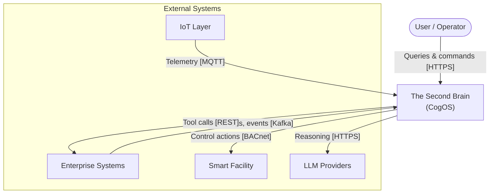
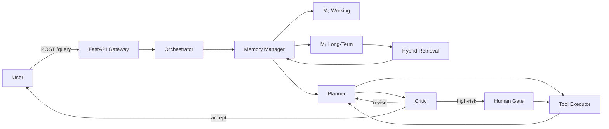
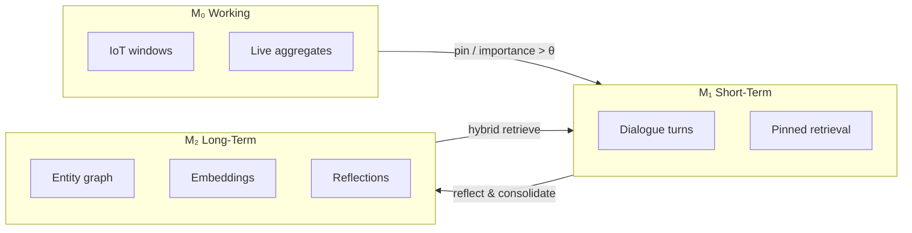
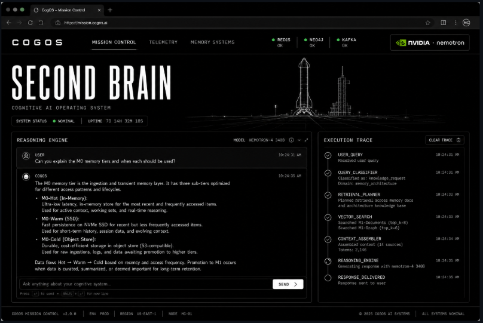

<div align="center">

# The Second Brain

### Open-source Cognitive Operating System (CogOS)

**Multi-agent orchestration · tiered memory (M₀ / M₁ / M₂) · Graph-RAG hybrid retrieval · stream-native ingestion**

[](https://www.python.org/)
[](pyproject.toml)
[](LICENSE)
[](https://github.com/langchain-ai/langgraph)
[](https://neo4j.com/)
[](https://kafka.apache.org/)
[](https://fastapi.tiangolo.com/)
[](https://build.nvidia.com/)

Inspired by [MemGPT](https://arxiv.org/abs/2310.08560) · [Generative Agents](https://arxiv.org/abs/2304.03442) · [Graph-RAG](https://arxiv.org/abs/2404.16130)

**Default reasoning model:** [`nvidia/nemotron-3-ultra-550b-a55b`](https://build.nvidia.com/) via NVIDIA NIM (OpenAI-compatible). Swap to OpenAI or Ollama with `LLM_PROVIDER`.

[**Get Started**](#quick-start) · [**Dashboard**](#web-dashboard) · [**Architecture**](#architecture) · [**Testing**](#testing) · [**API**](#api-reference) · [**Full Docs**](docs/ARCHITECTURE_WORKFLOW.md)

</div>

---

## Table of Contents

- [Overview](#overview)
- [Why CogOS?](#why-cogos)
- [Use Cases](#use-cases)
- [Architecture](#architecture)
- [Memory Model](#memory-model)
- [Quick Start](#quick-start)
- [Web Dashboard](#web-dashboard)
- [Configuration](#configuration)
- [API Reference](#api-reference)
- [CLI Commands](#cli-commands)
- [Testing](#testing)
- [Evaluation](#evaluation)
- [Project Structure](#project-structure)
- [Technology Stack](#technology-stack)
- [Development](#development)
- [Roadmap](#roadmap)
- [Contributing & License](#contributing--license)

---

## Overview

**The Second Brain** is a production-oriented cognitive engine that unifies enterprise knowledge, real-time IoT telemetry, and autonomous multi-agent reasoning in one platform.

Where flat RAG pipelines treat memory as a single vector store, CogOS **partitions cognition by latency and role**, routes every answer through a **Critic** with provenance checks, and supports **human-in-the-loop** actuation for high-risk IoT commands.

| Capability | What it does |
|------------|--------------|
| **Tiered memory** | M₀ working (Redis) → M₁ short-term (context) → M₂ long-term (Neo4j + vectors) |
| **Graph-RAG** | Hybrid vector + graph retrieval with community summaries |
| **Multi-agent loop** | Orchestrator → Memory Manager → Planner → Tools → Critic |
| **Stream-native** | Kafka ingestion, Faust IoT windows, anomaly → agent trigger |
| **Evidence-grounded** | Critic verifies faithfulness before any response or action |

---

## Why CogOS?

| | Flat RAG | **The Second Brain (CogOS)** |
|---|----------|------------------------------|
| Memory | Single vector index | Three tiers with promotion & consolidation |
| Retrieval | Cosine similarity only | Vector ANN + graph expansion + fusion rank |
| Reasoning | One LLM call | LangGraph multi-agent with tool loop |
| Verification | None | Critic gate + citation subgraph |
| Real-time data | Batch-only | M₀ working memory + Stream Observer |
| IoT actions | N/A | Policy engine + human approval gate |

---

## Use Cases

**Enterprise knowledge graph** — Multi-hop queries over docs, code, and deployment logs with relational provenance.

> *"Why did checkout latency spike after yesterday's release?"*  
> Hybrid retrieve → graph traverse `DEPENDS_ON` → synthesize timeline → Critic verifies edges exist.

**Autonomous smart infrastructure** — Sub-second anomaly detection with policy-bounded actuation.

> *Zone temperature drift → Faust 3σ detection → Planner proposes setpoint → Critic checks comfort/tariff → MQTT command.*

---

## Architecture

Diagrams use **AWS-style reference layouts**: external systems on the left, ingestion plane in the center, CogOS runtime VPC with color-coded subnets, and protocol-labeled arrows (`[HTTPS]`, `[Kafka]`, `[MQTT]`).

### Data Ingestion Pipeline

End-to-end flow from external sources through Kafka into batch (Spark) and stream (Faust) subnets, then into memory tiers and agent orchestration.

<div align="center">


</div>

<p align="center"><em>External Systems → Ingestion Plane (Kafka) → CogOS Runtime VPC → Interface Layer (FastAPI + OpenTelemetry)</em></p>

| Subnet | Role | Components |
|--------|------|------------|
| **Batch Path** | Documents, code, logs | Spark → NER/RE → Embedding → Neo4j M₂ |
| **Stream Path** | IoT telemetry | Faust → Anomaly detection → Stream Observer |
| **Memory Tier** | Hierarchical store | M₀ Redis · M₁ Context · M₂ Neo4j + vectors |
| **Agent Orchestration** | Reasoning loop | Orchestrator → Planner → Tools → Critic |
| **Ingestion Plane** | Event bus | Kafka topics · at-least-once delivery · idempotent MERGE |

<details>
<summary><strong>Text pipeline flow</strong></summary>

```
External Systems          Ingestion Plane              CogOS Platform
─────────────────         ───────────────              ──────────────
Documents    ──┐
Code Repos   ──┼──►  Kafka (raw.*)  ──►  Spark  ──►  NER/RE ──► M₂ Neo4j
Logs         ──┘         │                              │
                         │                              ▼
IoT Sensors ──► MQTT ──► stream.iot ──► Faust ──► M₀ Redis ──► Agents
```

</details>

### System Context



### Query & Reasoning Pipeline



| Stage | p99 SLO | Description |
|-------|---------|-------------|
| Hybrid retrieval | < 300 ms | Vector ANN seeds → graph expansion → fusion rank |
| Context assembly | < 200 ms | Memory Manager builds C_t within token budget |
| End-to-end QA | < 5 s | Full agent loop with critic revision |
| IoT actuation | < 2 s | Anomaly → plan → policy → MQTT/BACnet |

> Full blueprint with formulas, schemas, and SLOs: **[docs/ARCHITECTURE_WORKFLOW.md](docs/ARCHITECTURE_WORKFLOW.md)**

---

## Memory Model

CogOS treats memory like an operating system — not a flat database.



| Tier | Store | TTL | Role |
|------|-------|-----|------|
| **M₀** Working | Redis Streams | Seconds–minutes | Real-time stream state, anomaly buffers |
| **M₁** Short-Term | LLM context window | Session | Active reasoning surface, pinned evidence |
| **M₂** Long-Term | Neo4j + vector index | Permanent | Archival knowledge, relationships, reflections |

---

## Quick Start

### Prerequisites

| Requirement | Notes |
|-------------|-------|
| Python **3.11+** | Required |
| [Docker Desktop](https://www.docker.com/products/docker-desktop/) | Optional — Neo4j, Kafka, Redis, Mosquitto |
| `OPENAI_API_KEY` | Optional — heuristic planner fallback without it |

### Install

<details open>
<summary><strong>Windows (PowerShell)</strong></summary>

```powershell
git clone https://github.com/achrafS133/SECOND_BRAIN.git
cd SECOND_BRAIN
.\scripts\setup.ps1
copy .env.example .env
```

</details>

<details>
<summary><strong>Linux / macOS</strong></summary>

```bash
git clone https://github.com/achrafS133/SECOND_BRAIN.git
cd SECOND_BRAIN
python3 -m venv .venv
source .venv/bin/activate
pip install -e ".[dev]"
cp .env.example .env
```

</details>

### Run

```bash
# 1. Start infrastructure (optional)
.\scripts\start-infra.ps1          # Windows
docker compose -f infra/docker-compose.yml up -d   # Linux/macOS

# 2. Start API (skip if already running on 8090)
python -m uvicorn second_brain.api.main:app --host 0.0.0.0 --port 8090

# 3. Seed sample data & run a query (NVIDIA Nemotron 3 Ultra when LLM_PROVIDER=nvidia)
second-brain-seed
second-brain query "What is the memory tier model?"
```

> **LLM:** Set `LLM_PROVIDER=nvidia` and `LLM_MODEL=nvidia/nemotron-3-ultra-550b-a55b` in `.env` (see [Configuration](#configuration)). Get an API key from [NVIDIA NIM](https://build.nvidia.com/).

### Services (with Docker)

| Service | URL | Default credentials |
|---------|-----|---------------------|
| **Web dashboard** | http://localhost:8090/ | — |
| **API docs** | http://localhost:8090/docs | — |
| **Health check** | http://localhost:8090/health | — |
| **Neo4j Browser** | http://localhost:7474 | `neo4j` / `secondbrain_dev` |
| **Kafka** | `localhost:9092` | — |
| **Redis** | `localhost:6379` | — |
| **MQTT (Mosquitto)** | `localhost:1883` | — |

> Without Docker, the app falls back to in-memory M₀/M₂ stores.

---

## Web Dashboard

SpaceX-inspired **Mission Control** UI — chat with the reasoning engine, stream IoT telemetry, approve actuator commands, and manage tiered memory.

<div align="center">



</div>

<p align="center"><em>Mission Control · Telemetry · Memory Systems — powered by <strong>NVIDIA Nemotron 3 Ultra</strong> (550B MoE) · OpenAI · Ollama</em></p>

| Tab | What you can do |
|-----|-----------------|
| **Mission Control** | Ask questions, view agent execution trace |
| **Telemetry** | Push IoT readings, simulate anomalies, approve actions |
| **Memory Systems** | Ingest documents, consolidate sessions, build Graph-RAG summaries |

Open after starting the API: **http://localhost:8090/** (or your `API_PORT` in `.env`).

---

## Configuration

Copy `.env.example` to `.env` and adjust as needed.

### Recommended LLM setup (NVIDIA Nemotron 3 Ultra)

This project is tested and tuned with **NVIDIA NIM** and **`nvidia/nemotron-3-ultra-550b-a55b`**:

```env
LLM_PROVIDER=nvidia
LLM_MODEL=nvidia/nemotron-3-ultra-550b-a55b
NVIDIA_API_KEY=nvapi-your-key-here
NVIDIA_BASE_URL=https://integrate.api.nvidia.com/v1
```

Optional: set `LLM_ENABLE_THINKING=true` for extended reasoning on supported NIM deployments.

| Variable | Default | Description |
|----------|---------|-------------|
| `LLM_PROVIDER` | `nvidia` | LLM backend: `openai`, `nvidia`, or `ollama` |
| `LLM_MODEL` | `nvidia/nemotron-3-ultra-550b-a55b` | Active model (overrides provider default when set) |
| `OPENAI_API_KEY` | — | OpenAI API key (when `LLM_PROVIDER=openai`) |
| `NVIDIA_API_KEY` | — | NVIDIA NIM key ([integrate.api.nvidia.com](https://integrate.api.nvidia.com/)) |
| `NVIDIA_MODEL` | `nvidia/nemotron-3-ultra-550b-a55b` | Fallback NVIDIA slug if `LLM_MODEL` is empty |
| `OLLAMA_BASE_URL` | `http://localhost:11434/v1` | Local Ollama OpenAI-compatible endpoint |
| `OLLAMA_MODEL` | `llama3.2` | Ollama model tag |
| `NEO4J_URI` | `bolt://localhost:7687` | Graph database connection |
| `REDIS_URL` | `redis://localhost:6379/0` | M₀ working memory |
| `KAFKA_BOOTSTRAP_SERVERS` | `localhost:9092` | Ingestion event bus |
| `CONTEXT_TOKEN_BUDGET` | `8192` | M₁ context window budget |
| `RETRIEVAL_TOP_K` | `8` | Hybrid retrieval depth |
| `IOT_DRY_RUN` | `true` | Disable real actuation commands |
| `REQUIRE_HUMAN_APPROVAL` | `true` | Human gate for IoT actions |
| `MQTT_ENABLED` | `false` | Enable MQTT bridge (`pip install ".[mqtt]"`) |

---

## API Reference

Interactive docs: **http://localhost:8090/docs**

| Method | Endpoint | Description |
|--------|----------|-------------|
| `GET` | `/` | Web dashboard (Mission Control UI) |
| `GET` | `/health` | Service health, LLM provider/model, dependency status |
| `POST` | `/query` | Evidence-grounded Q&A (Nemotron / OpenAI / Ollama) |
| `POST` | `/query/stream` | Same as `/query` with **SSE live execution trace** |
| `POST` | `/ingest/document` | Ingest text into M₂ graph |
| `POST` | `/stream/iot` | Push IoT telemetry event |
| `POST` | `/memory/consolidate` | Promote session → long-term |
| `POST` | `/graph/communities/build` | Build GraphRAG community summaries |
| `GET` | `/actions/pending` | List actions awaiting approval |
| `POST` | `/actions/propose` | Propose an IoT action |
| `POST` | `/actions/{id}/approve` | Approve or reject an action |

### Examples

**Ingest a document**

```bash
curl -X POST http://localhost:8090/ingest/document \
  -H "Content-Type: application/json" \
  -d '{"uri":"doc://test","title":"Test","content":"The Second Brain uses M0, M1, and M2 memory tiers."}'
```

**Query (Nemotron 3 Ultra)**

```bash
curl -X POST http://localhost:8090/query \
  -H "Content-Type: application/json" \
  -d '{"query":"Explain the memory tiers","session_id":"demo-1","task_type":"qa"}'
```

**Live trace (SSE)**

```bash
curl -N -X POST http://localhost:8090/query/stream \
  -H "Content-Type: application/json" \
  -d '{"query":"Explain M0 memory tiers","session_id":"demo-1"}'
```

**IoT telemetry**

```bash
curl -X POST http://localhost:8090/stream/iot \
  -H "Content-Type: application/json" \
  -d '{"device_id":"sensor-1","zone_id":"zone-a","metric":"temperature","value":23.5}'
```

**Approve a pending action**

```bash
curl -X POST http://localhost:8090/actions/{action_id}/approve \
  -H "Content-Type: application/json" \
  -d '{"approved": true, "reviewer": "operator", "note": "looks good"}'
```

---

## CLI Commands

| Command | Description |
|---------|-------------|
| `second-brain-api` | Start FastAPI gateway |
| `second-brain ingest <file>` | Ingest a local document |
| `second-brain query "<text>"` | Run a CLI query |
| `second-brain-seed` | Seed sample knowledge + IoT demo |
| `second-brain-bootstrap` | Initialize Neo4j schema |
| `second-brain-pipeline` | Kafka document pipeline worker (`second-brain-pipeline iot` for IoT) |
| `second-brain-eval` | Enterprise QA benchmark |
| `second-brain-ablation` | Flat RAG vs full CogOS ablation study |
| `second-brain-iot-eval` | IoT action correctness benchmark |

---

## Testing

### API integration script (recommended)

End-to-end smoke test for health, dashboard, NVIDIA/OpenAI/Ollama query, ingest, and IoT anomaly flow:

```powershell
# Start API first
python -m uvicorn second_brain.api.main:app --host 0.0.0.0 --port 8090

# Full test (7 checks)
.\scripts\test-api.ps1 -Port 8090

# Quick test (skip IoT/LLM anomaly step)
.\scripts\test-api.ps1 -SkipAnomaly

# Full test + auto-approve first pending action
.\scripts\test-api.ps1 -ApproveAction
```

**Verified output (all passing):**

```
Second Brain API Tests
Target: http://localhost:8090
--------------------------------------------------
  [PASS] Health check          LLM: nvidia / nvidia/nemotron-3-ultra-550b-a55b
  [PASS] Dashboard             HTTP 200
  [PASS] Root redirect         /static/index.html
  [PASS] Query (POST /query)   M0 working memory handles IoT streams...
  [PASS] Ingest                1 chunk(s)
  [PASS] IoT anomaly           pending action created
  [PASS] Pending actions       N action(s)
--------------------------------------------------
All 7 test(s) passed.
```

| Script flag | Description |
|-------------|-------------|
| `-Port 8090` | API port (default `8090`) |
| `-SkipAnomaly` | Skip slow IoT warmup + anomaly LLM call |
| `-ApproveAction` | Approve the first pending IoT action after anomaly test |

### Unit tests

```powershell
pytest
pytest tests/test_api.py tests/test_cogos_tools.py -q
```

---

## Evaluation

Built-in benchmarks measure quality beyond naive accuracy.

| Metric | Target | Method |
|--------|--------|--------|
| Faithfulness | ≥ 0.85 | NLI entailment: claims ⊆ evidence |
| Graph grounding | ≥ 0.90 | Cited nodes/edges exist in ground truth |
| Answer relevance | ≥ 0.80 | RAGAS-style relevancy scorer |
| IoT action correctness | ≥ 95% | Actions vs oracle policy |

```powershell
second-brain-seed
second-brain-eval          # Enterprise QA
second-brain-ablation      # Reports → eval/reports/
second-brain-iot-eval      # IoT policy benchmark
```

---

## Project Structure

```
SECOND_BRAIN/
├── docs/
│   ├── ARCHITECTURE_WORKFLOW.md          # Full blueprint (formulas, SLOs, schemas)
│   └── diagrams/
│       ├── second-brain-pipeline-aws-style.png   # Primary architecture diagram
│       ├── ingestion-pipeline-arch.svg
│       ├── query-pipeline-aws.svg
│       └── system-context-c4.svg
├── infra/                                # Docker Compose stack
├── graph/schema/                         # Neo4j init Cypher
├── ingestion/                            # Spark & Faust worker stubs
├── eval/                                 # Benchmarks & ablation reports
├── scripts/                              # setup.ps1, start-infra.ps1, test-api.ps1
├── src/second_brain/
│   ├── agents/                           # LangGraph multi-agent graph
│   ├── memory/                           # M₀, M₁, M₂ + embeddings + retrieval
│   ├── api/                              # FastAPI gateway
│   ├── ingestion/                        # Kafka, MQTT, NER/RE
│   ├── graph/                            # Document loader, community summaries
│   ├── eval/                             # Benchmark & ablation runners
│   └── services/                         # DI container, action orchestrator
└── tests/
```

---

## Technology Stack

| Layer | Choice |
|-------|--------|
| Agent orchestration | LangGraph |
| API | FastAPI + Uvicorn |
| Graph + vectors | Neo4j 5.x |
| Message bus | Apache Kafka |
| Batch processing | Spark Structured Streaming |
| Stream processing | Faust |
| Working memory | Redis Streams |
| Embeddings | sentence-transformers |
| Observability | OpenTelemetry + structlog |
| LLM | **NVIDIA NIM** (`nvidia/nemotron-3-ultra-550b-a55b` default) · OpenAI · Ollama |

---

## Development

```powershell
# Run unit tests
pytest

# API integration smoke test (see Testing section)
.\scripts\test-api.ps1

# Lint
ruff check src tests

# Preview architecture docs locally
node scripts/preview-architecture.mjs   # → http://localhost:8765

# Sanitize SVG diagrams before commit
python scripts/fix_svg.py
```

---

## Roadmap

| Phase | Status | Deliverables |
|-------|--------|--------------|
| **0** Foundation | ✅ | Scaffold, Docker, schemas, LangGraph baseline |
| **1** Ingestion → M₂ | ✅ | Chunking, NER/RE, hybrid scoring, Kafka pipeline |
| **2** Memory tiering | ✅ | Reflection consolidation, session promotion |
| **3** Streaming M₀ | ✅ | Stream Observer, IoT windows, anomaly → agent |
| **4** Full agent graph | ✅ | Human approval gate, IoT policy, action API |
| **5** Benchmarks | ✅ | Community summaries, enterprise QA scorers |
| **6** Paper & MQTT | ✅ | Ablation runner, IoT benchmark, MQTT bridge |
| **7** Web UI & LLM | ✅ | SpaceX-style dashboard, multi-provider LLM (OpenAI / NVIDIA / Ollama), `test-api.ps1` |
| **8** Production & Streaming | ✅ | Dockerfile, GitHub Actions CI, Kafka workers, SSE live trace, eval reports |

### Phase 8 quick start

```powershell
# Full stack (infra + API + Kafka workers)
docker compose -f infra/docker-compose.yml --profile app up -d --build

# Run benchmarks (requires LLM key in .env)
.\scripts\run-eval.ps1

# Live trace query (SSE)
curl -N -X POST http://localhost:8090/query/stream \
  -H "Content-Type: application/json" \
  -d '{"query":"Explain M0 memory tiers","session_id":"demo-1"}'
```


## Contributing & License

Contributions are welcome — open an [issue](https://github.com/achrafS133/SECOND_BRAIN/issues) or [pull request](https://github.com/achrafS133/SECOND_BRAIN/pulls).

Licensed under **[Apache License 2.0](LICENSE)**.

### References

- Packer et al., *MemGPT: Towards LLMs as Operating Systems* (2023)
- Park et al., *Generative Agents* (2023)
- Edge et al., *Graph RAG* (2024)
- Yao et al., *ReAct* (2023)

---

<div align="center">

**Tiered · Relational · Stream-native · Evidence-grounded**

If this project helps you, consider giving it a ⭐ on [GitHub](https://github.com/achrafS133/SECOND_BRAIN).

</div>
