# The Second Brain — Architecture & Workflow

> **An Open-Source Cognitive Operating System (CogOS)**  
> Multi-agent orchestration · hierarchical memory · graph-augmented hybrid retrieval · stream-native ingestion

---

## Table of Contents

1. [Vision & Design Principles](#1-vision--design-principles)
2. [System Context](#2-system-context)
3. [Layered Architecture](#3-layered-architecture)
4. [Cognitive Memory Model](#4-cognitive-memory-model)
5. [Core Workflows](#5-core-workflows)
6. [Multi-Agent Orchestration](#6-multi-agent-orchestration)
7. [Graph-RAG Hybrid Retrieval](#7-graph-rag-hybrid-retrieval)
8. [Data Ingestion Pipeline](#8-data-ingestion-pipeline)
9. [Target Use Cases](#9-target-use-cases)
10. [Technology Stack](#10-technology-stack)
11. [Implementation Roadmap](#11-implementation-roadmap)
12. [Evaluation & SLOs](#12-evaluation--slos)
13. [Repository Layout](#13-repository-layout)

---

## 1. Vision & Design Principles

**The Second Brain** is a production-grade cognitive engine that unifies:


| Inspiration           | Contribution to CogOS                                                     |
| --------------------- | ------------------------------------------------------------------------- |
| **MemGPT**            | Self-managed context vs. archival memory; memory ops as first-class tools |
| **Generative Agents** | Importance-weighted recall, reflection, and episodic consolidation        |
| **Graph-RAG**         | Community-aware relational retrieval over knowledge graphs                |


### Design Principles


| Principle                 | Meaning                                                                            |
| ------------------------- | ---------------------------------------------------------------------------------- |
| **Tiered, not flat**      | Memory is partitioned by latency, durability, and cognitive role                   |
| **Relational + semantic** | Hybrid graph-vector search beats pure embedding retrieval on multi-hop queries     |
| **Stream-native**         | Real-time state (IoT, logs) flows through working memory before archival promotion |
| **Agent-specialized**     | No monolithic LLM loop — roles are explicit, auditable, and composable             |
| **Evidence-grounded**     | Every answer and action passes through a Critic with provenance requirements       |
| **Production-first**      | Observability, idempotency, and SLOs are first-class, not afterthoughts            |


---

## 2. System Context

C4 Level 1 view of The Second Brain and its external actors.

### Interactive diagram (Cursor / GitHub compatible)

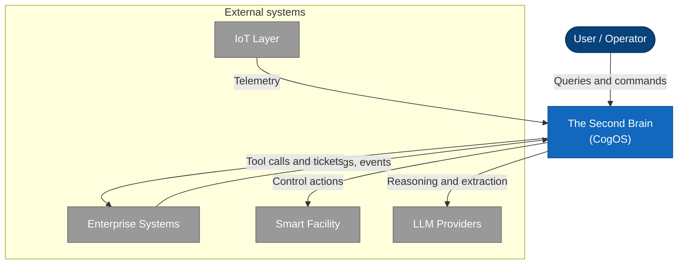

### C4 diagram (pre-rendered)

Cursor’s markdown preview does **not** support the `C4Context` diagram type (it reports a syntax error even when the source is valid). Use the static export below, or render the source file with [Mermaid Live Editor](https://mermaid.live) or Mermaid CLI 10.7+.


**Source:** [`docs/diagrams/system-context.c4.mmd`](./diagrams/system-context.c4.mmd)

```bash
npx @mermaid-js/mermaid-cli -i docs/diagrams/system-context.c4.mmd -o docs/diagrams/system-context-c4.svg
```


---

## 3. Layered Architecture

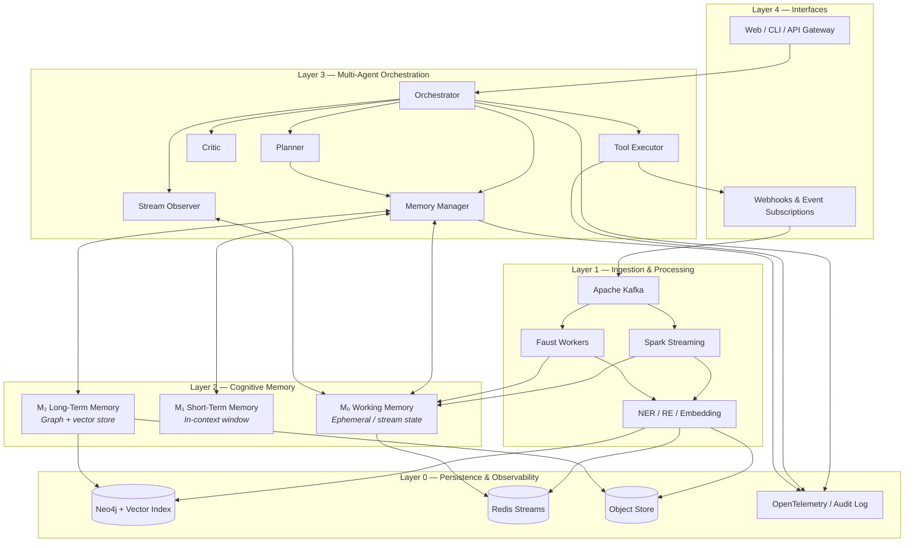


### Layer Responsibilities


| Layer                | Responsibility                    | Key Components                         |
| -------------------- | --------------------------------- | -------------------------------------- |
| **L4 — Interfaces**  | Auth, routing, session management | FastAPI gateway, WebSocket for streams |
| **L3 — Agents**      | Reasoning, verification, action   | LangGraph state machine                |
| **L2 — Memory**      | Tiering, retrieval, compaction    | Memory Manager + policies              |
| **L1 — Ingestion**   | Real-time and batch data intake   | Kafka, Spark, Faust                    |
| **L0 — Persistence** | Durable storage, tracing          | Neo4j, Redis, S3, OTEL                 |


---

## 4. Cognitive Memory Model

### 4.1 Memory Tiers

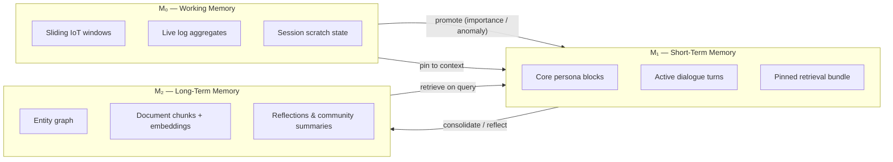


| Tier       | Symbol | Store                | TTL             | Role                                               |
| ---------- | ------ | -------------------- | --------------- | -------------------------------------------------- |
| Working    | M_0    | Redis / Flink state  | Seconds–minutes | Real-time stream aggregates, anomaly buffers       |
| Short-term | M_1    | LLM context window   | Session         | Active reasoning surface; MemGPT-style core blocks |
| Long-term  | M_2    | Neo4j + vector index | Permanent       | Archival knowledge, relationships, reflections     |


### 4.2 Formal Memory State

At time t, system memory is:


\mathcal{M}_t = \big(M_0^{(t)}, M_1^{(t)}, M_2\big)


Each observation o_i is a tuple:


o_i = (\text{text}_i, t_i, \mathbf{e}_i, \phi_i, s_i)


where \mathbf{e}_i is the embedding, \phi_i is metadata (source, modality, agent), and s_i \in \text{observation}, \text{reflection}, \text{plan}.

### 4.3 Retrieval Score

When the agent issues query q at time t, each long-term unit m is ranked by:


R(m \mid q, t) = \alpha \cdot \text{sim}(q, m) + \beta \cdot e^{-(t - t_m)/\tau} + \gamma \cdot I(m) + \delta \cdot \Psi_G(m, q)


| Term              | Meaning                                         |
| ----------------- | ----------------------------------------------- |
| \text{sim}(q, m)  | Cosine similarity in embedding space            |
| e^{-(t-t_m)/\tau} | Recency decay (Generative Agents)               |
| I(m)              | Importance score \in [0, 1]                     |
| \Psi_G(m, q)      | Graph proximity (path length, typed edge match) |


Top-k retrieval: \mathcal{R}_k = \text{top-}k m \in M_2 : R(m \mid q, t) 

### 4.4 Context Assembly

Given token budget B, the Memory Manager assembles:


C_t = \arg\max_{C \subseteq \mathcal{U}*t,\ |C| \le B} \sum*{x \in C} w(x) \cdot \text{utility}(x, q)


**Hard constraints:**

- Pinned M_0 stream state is always included (IoT anomalies, live dashboards)
- System and persona core blocks are reserved
- Lowest-utility dialogue turns are evicted first (FIFO + utility hybrid)

### 4.5 Promotion & Consolidation

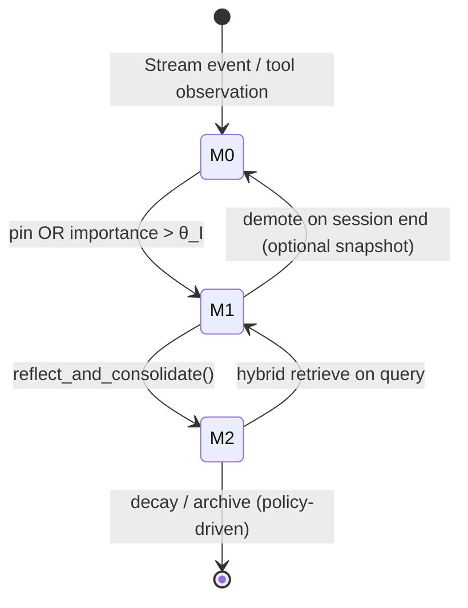


**Promotion rule:**


\text{promote}(o) \iff I(o) > \theta_I \lor \text{repeataccess}(o) > \theta_a \lor \text{criticflag}(o)


**Reflection (episodic → semantic):**


r = f_{\text{LLM}}\big(o_j\big), \quad M_2 \leftarrow M_2 \cup r, \quad \text{link}(r, o_j)


---

## 5. Core Workflows

### 5.1 End-to-End Query Workflow

Primary path: user question → evidence-backed answer.

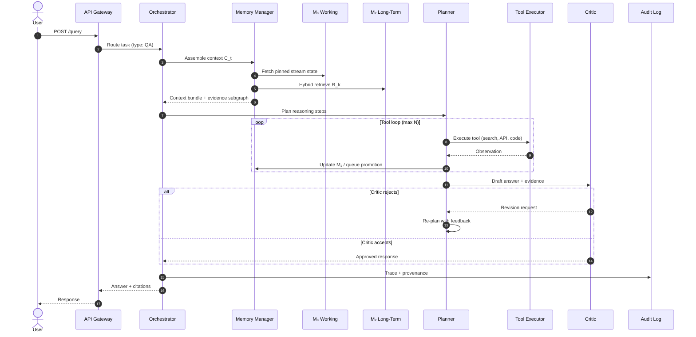


### 5.2 Real-Time Ingestion Workflow

Continuous path: external data → working memory → long-term graph.

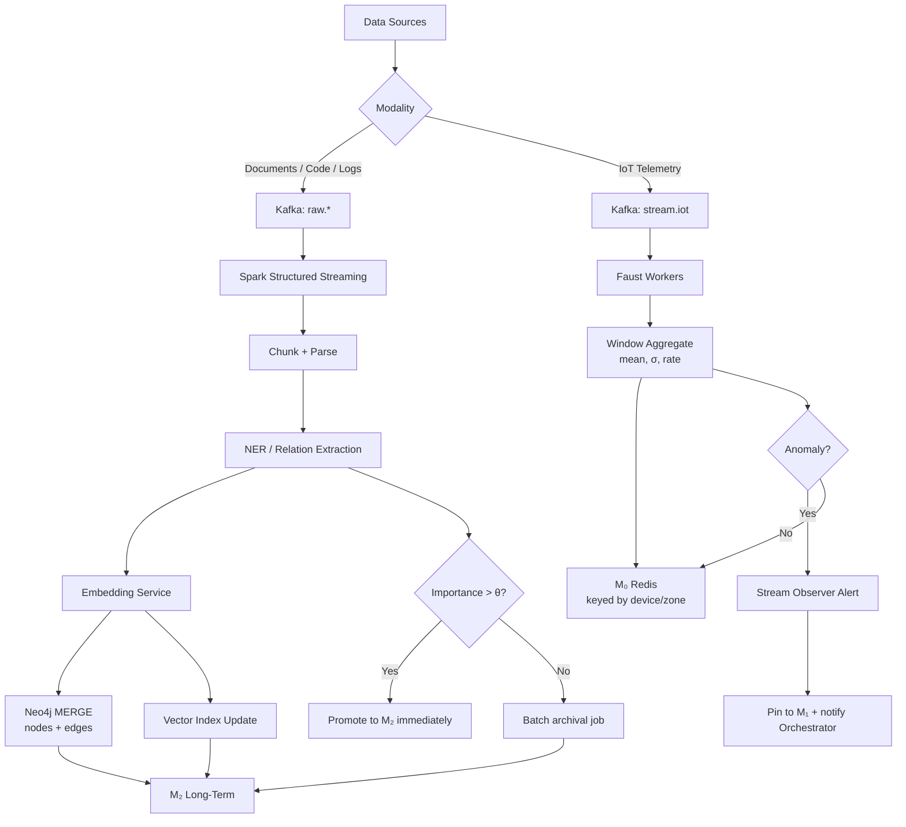


### 5.3 Autonomous Action Workflow (IoT / Smart Facility)

Action path: anomaly → plan → policy check → actuate.

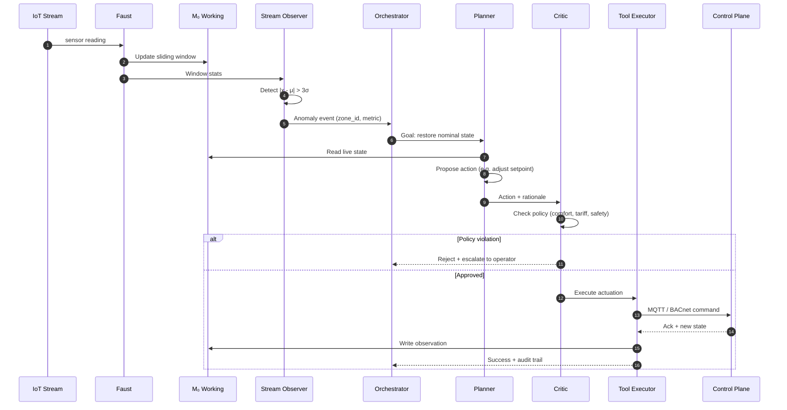


### 5.4 Memory Lifecycle Workflow

Background path: session data → durable knowledge.

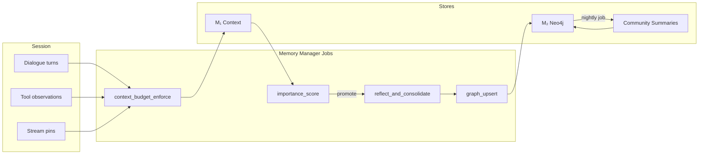


---

## 6. Multi-Agent Orchestration

### 6.1 Agent Roles

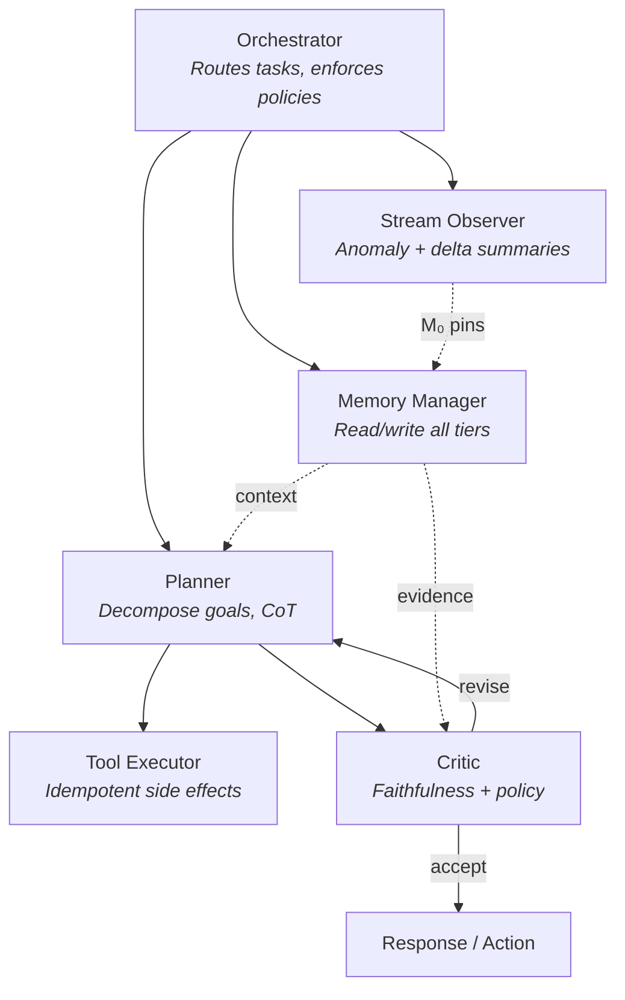


| Agent               | Inputs                        | Outputs                   | Tools                                                                |
| ------------------- | ----------------------------- | ------------------------- | -------------------------------------------------------------------- |
| **Orchestrator**    | Query, stream events, session | Subgraph selection        | `route_task`, `set_policy`                                           |
| **Memory Manager**  | Query, agent state            | C_t, evidence set         | `core_append`, `archival_search`, `graph_traverse`, `pin`, `reflect` |
| **Planner**         | C_t, tool schemas             | Plan steps, sub-queries   | reasoning only                                                       |
| **Tool Executor**   | Approved actions              | Observations              | repo search, APIs, IoT control                                       |
| **Critic**          | Draft + evidence subgraph     | accept / revise / reject  | NLI check, policy engine                                             |
| **Stream Observer** | Faust windows                 | Anomaly events, summaries | statistical templates                                                |


### 6.2 LangGraph Control Flow

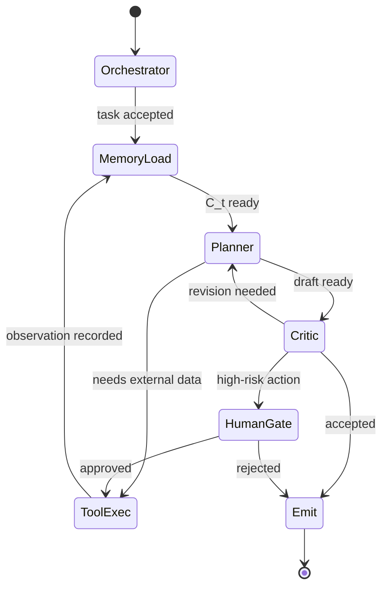


### 6.3 Shared State Schema

```python
class CogOSState(TypedDict):
    messages: Annotated[list, add_messages]
    task_type: str                          # "qa" | "action" | "anomaly"
    working_memory: dict                      # M₀ handles
    context_bundle: list[dict]                # assembled M₁ content
    retrieved_evidence: list[dict]            # M₂ subgraph
    plan: list[str]
    tool_results: list[dict]
    critic_verdict: Optional[str]             # accept | revise | reject
    audit_trail: list[dict]
```

---

## 7. Graph-RAG Hybrid Retrieval

### 7.1 Retrieval Pipeline

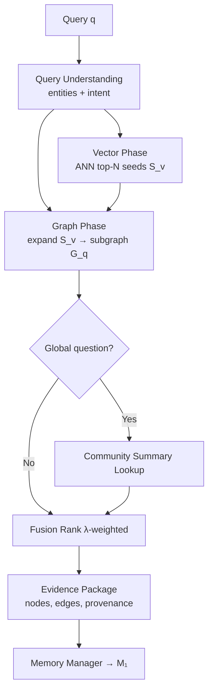


### 7.2 Fusion Score


\text{score}(n) = \lambda_1 \cdot \text{sim}(q, n) + \lambda_2 \cdot \text{PageRank}_G(n) + \lambda_3 \cdot \text{recency}(n) + \lambda_4 \cdot \text{importance}(n)


### 7.3 Graph Schema (Neo4j)

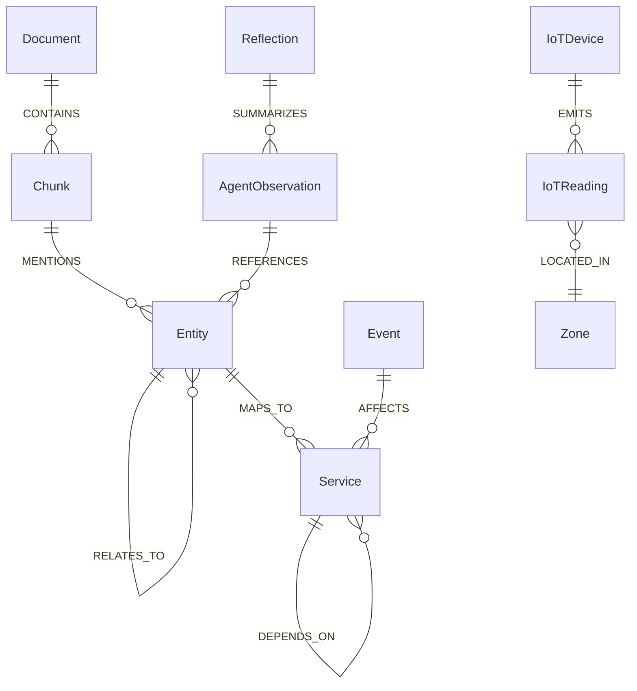


| Node Label   | Key Properties                     |
| ------------ | ---------------------------------- |
| `Document`   | `uri`, `title`, `updated_at`       |
| `Chunk`      | `text`, `embedding`, `chunk_id`    |
| `Entity`     | `name`, `type`, `canonical_id`     |
| `Service`    | `name`, `repo`, `owner`            |
| `Event`      | `type`, `timestamp`, `severity`    |
| `IoTDevice`  | `device_id`, `protocol`            |
| `Reflection` | `text`, `importance`, `created_at` |


---

## 8. Data Ingestion Pipeline

### 8.1 Kafka Topic Map


| Topic                 | Producer      | Consumer       | Partition Key |
| --------------------- | ------------- | -------------- | ------------- |
| `raw.documents`       | Doc crawler   | Spark          | `tenant_id`   |
| `raw.code`            | Git webhook   | Spark          | `repo_id`     |
| `raw.logs`            | Log shipper   | Spark          | `service_id`  |
| `stream.iot`          | MQTT bridge   | Faust          | `device_id`   |
| `derived.entities`    | NER pipeline  | Neo4j loader   | `entity_id`   |
| `memory.observations` | Agents        | Memory service | `session_id`  |
| `audit.actions`       | Tool Executor | Audit store    | `trace_id`    |


### 8.2 Processing Split

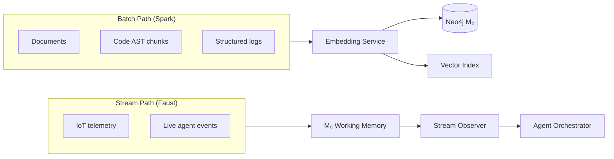


### 8.3 Ingestion Guarantees


| Guarantee                   | Mechanism                                       |
| --------------------------- | ----------------------------------------------- |
| **At-least-once delivery**  | Kafka consumer groups + offset commits          |
| **Idempotent graph writes** | `MERGE` on `(source_uri, chunk_id)`             |
| **Ordering per entity**     | Partition by `device_id` / `service_id`         |
| **Backpressure**            | Consumer lag alerts; auto-scale Spark executors |


---

## 9. Target Use Cases

### 9.1 Enterprise Knowledge Graph

**Goal:** Reason over docs, codebases, and deployment logs with multi-hop relational queries.

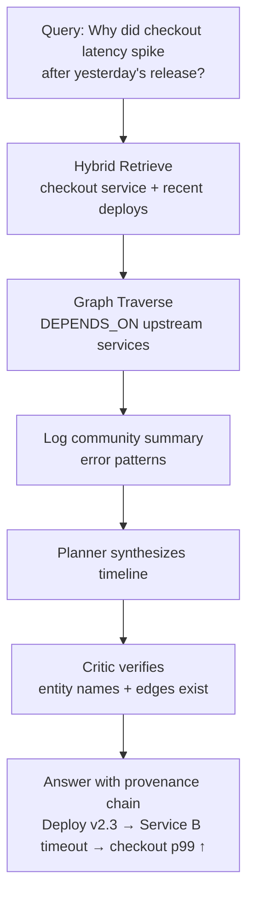


**Demonstration metrics:** faithfulness ≥ 0.85, graph grounding ≥ 0.90.

### 9.2 Autonomous Smart Infrastructure

**Goal:** Detect anomalies and act within policy bounds in sub-second latency.

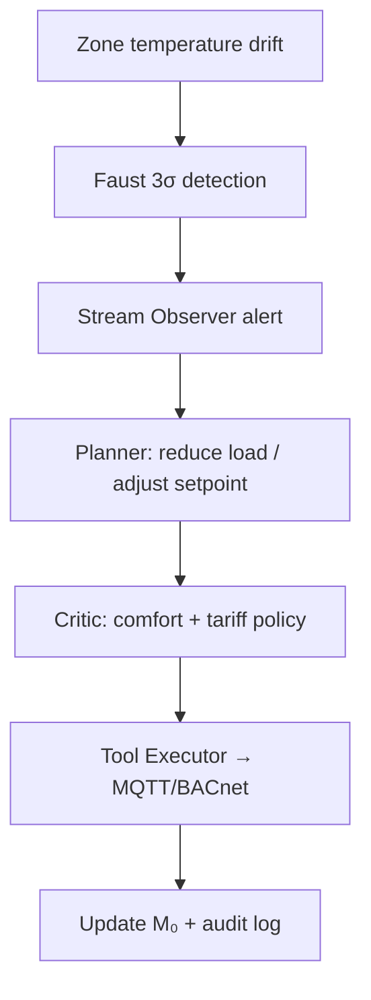


**Demonstration metrics:** p99 actuation latency < 2s, zero policy violations in eval harness.

---

## 10. Technology Stack


| Layer               | Primary Choice                           | Alternatives                   |
| ------------------- | ---------------------------------------- | ------------------------------ |
| Agent orchestration | **LangGraph**                            | CrewAI, AutoGen                |
| LLM                 | Llama 3.x / Mistral (self-hosted)        | OpenAI, Anthropic API          |
| Graph DB            | **Neo4j 5.x** (native vector)            | Memgraph, FalkorDB             |
| Message bus         | **Apache Kafka**                         | Redpanda, Pulsar               |
| Batch processing    | **Spark Structured Streaming**           | Flink batch                    |
| Stream processing   | **Faust**                                | Flink streaming, Kafka Streams |
| Working memory      | **Redis Streams**                        | Flink keyed state              |
| Embeddings          | BGE-M3                                   | OpenAI text-embedding-3        |
| API                 | FastAPI                                  | —                              |
| Observability       | OpenTelemetry + Prometheus + Grafana     | —                              |
| Eval                | RAGAS + custom graph benchmarks          | —                              |
| Infrastructure      | Docker Compose (dev) → Kubernetes (prod) | —                              |


---

## 11. Implementation Roadmap

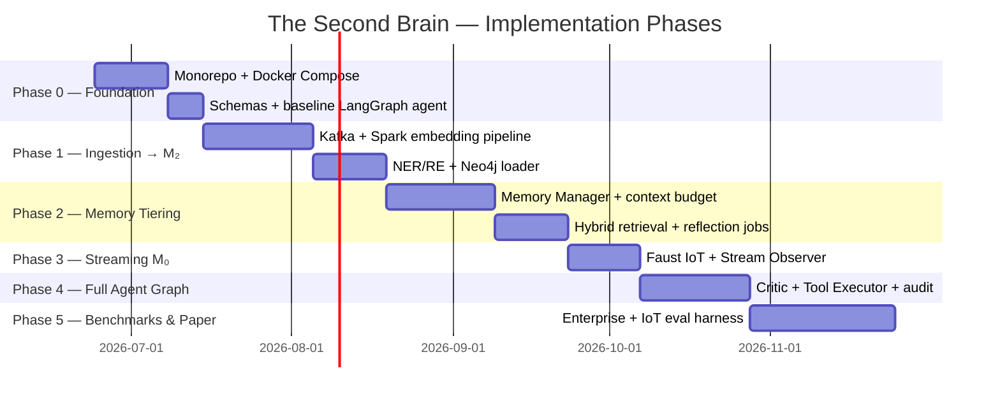


### Phase Checklist

- [ ] **Phase 0** — Repo scaffold, Docker Compose (Kafka, Neo4j, Redis), Pydantic schemas, OTEL
- [ ] **Phase 1** — Ingestion pipelines, embedding service, Neo4j hybrid index, community summaries
- [ ] **Phase 2** — Memory Manager, R(m|q,t) retrieval, promotion/demotion, reflection consolidation
- [ ] **Phase 3** — Faust streaming, M_0 Redis, Stream Observer, anomaly → agent trigger
- [ ] **Phase 4** — Full LangGraph loop, Critic, human approval gate, tool registry
- [ ] **Phase 5** — Benchmarks, ablation study, paper draft, open-source release

---

## 12. Evaluation & SLOs

### 12.1 Quality Metrics


| Metric                 | Formula / Method                        | Target |
| ---------------------- | --------------------------------------- | ------ |
| **Faithfulness**       | NLI entailment: claims ⊆ evidence       | ≥ 0.85 |
| **Answer Relevance**   | RAGAS `answer_relevancy`                | ≥ 0.80 |
| **Graph Grounding**    | Cited nodes/edges exist in ground truth | ≥ 0.90 |
| **Hallucination Rate** | Unsupported entity mentions             | ≤ 5%   |
| **Action Correctness** | IoT actions vs oracle policy            | ≥ 95%  |


F = \frac{1}{N}\sum_{i=1}^{N} \mathbb{1}\left[\forall c \in \text{claims}(a_i), \exists e \in E_i: \text{entails}(e, c)\right]


### 12.2 Latency SLOs


| Path                        | p50     | p99     |
| --------------------------- | ------- | ------- |
| QA end-to-end               | < 2s    | < 5s    |
| Hybrid retrieval only       | < 100ms | < 300ms |
| IoT anomaly → actuation     | < 500ms | < 2s    |
| Context assembly            | < 50ms  | < 200ms |
| Kafka consumer lag (stream) | —       | < 1s    |


### 12.3 Ablation Matrix (Paper)


| Config            | M₀  | M₁        | M₂ Hybrid   | Multi-Agent | Expected Δ Faithfulness |
| ----------------- | --- | --------- | ----------- | ----------- | ----------------------- |
| Flat RAG baseline | ✗   | naive     | vector only | ✗           | —                       |
| + Graph           | ✗   | naive     | ✓           | ✗           | +5–10%                  |
| + Tiered memory   | ✓   | MemGPT    | ✓           | ✗           | +5–8%                   |
| **Full CogOS**    | ✓   | optimized | ✓           | ✓ + Critic  | +10–15%                 |


---

## 13. Repository Layout

```
Second_Brain/
├── docs/
│   └── ARCHITECTURE_WORKFLOW.md      ← this document
├── ingestion/
│   ├── kafka/                        # Producers, topic configs
│   ├── spark/                        # Batch/stream jobs
│   └── faust/                        # IoT stream workers
├── memory/
│   ├── tiers/                        # M₀, M₁, M₂ implementations
│   ├── retrieval/                    # Hybrid graph-vector search
│   └── consolidation/                # Reflection + promotion jobs
├── agents/
│   ├── graph/                        # LangGraph state machine
│   ├── roles/                        # MM, Planner, Critic, etc.
│   └── tools/                        # Tool registry
├── graph/
│   ├── schema/                       # Neo4j constraints, indexes
│   └── loader/                       # MERGE upsert logic
├── api/
│   └── gateway/                      # FastAPI entrypoint
├── eval/
│   ├── benchmarks/                   # Enterprise QA, IoT sim
│   └── metrics/                      # RAGAS + custom scorers
├── infra/
│   ├── docker-compose.yml
│   └── k8s/                          # Production manifests
└── observability/
    └── otel/                         # Tracing + audit
```

---

## Appendix A — Decision Log


| Decision          | Choice                      | Rationale                                                 |
| ----------------- | --------------------------- | --------------------------------------------------------- |
| Orchestrator      | LangGraph over CrewAI       | Stateful graphs, checkpointing, fine-grained control flow |
| Graph store       | Neo4j                       | Mature vector index, Cypher, GraphRAG community support   |
| Stream split      | Spark (batch) + Faust (IoT) | Right tool for throughput vs latency                      |
| Critic placement  | Post-planner gate           | Blocks unsafe actions before Tool Executor                |
| Human-in-the-loop | High-risk actuation only    | Balance autonomy and safety                               |


---

## Appendix B — References

- Packer et al., *MemGPT: Towards LLMs as Operating Systems* (2023)
- Park et al., *Generative Agents: Interactive Simulacra of Human Behavior* (2023)
- Edge et al., *From Local to Global: A Graph RAG Approach to Query-Focused Summarization* (2024)
- Yao et al., *ReAct: Synergizing Reasoning and Acting in Language Models* (2023)

---

*Document version: 1.0 · Project: The Second Brain · Last updated: 2026-06-24*